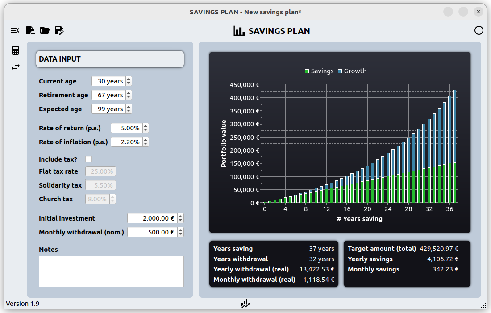

# savings_plan
## Summary
You can use this application, if you want to simulate how much money you need to invest on a monthy/yearly basis to be able to withdraw a fixed amount every month from this savings after you have retired.

This tool provides an environment for simulating the growth of such an investment plan mainly given the following parameters:
* The time you have for saving.
* The expected yearly rate of return for your investment.
* The expected yearly rate of inflation.
* The expected time you have for dissaving.
* The amount of money you want to withdraw after the saving phase has finished.

The application does not take into account the rate of inflation for the phase of dissaving.

To start the aplication just run `savings_plan_app.py`.

## Dependencies
You need to have `pyqt5` and `pyqtchart` installed (tested with version 5.15).
