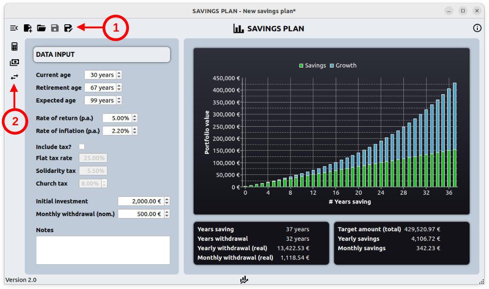

# savings_plan
## Summary
This application can be used to simulate and track financial investments. It consists of different workspaces that can help with different aspects/strategies of financial investments. The individual workspaces can be selected using the icons on the left.

For more information about each individual workspaces see [https://github.com/dibysn/savings_plan/wiki](https://github.com/dibysn/savings_plan/wiki).

To start the aplication just run `savings_plan_app.py`.

<ins>Area 1</ins>\
The following functions can be performed in this area:
* Show/hide the input form.
* Creating a new simulation.
* Open an existing simulation.
* Save the current simulation.

<ins>Area 2</ins>\
In this area different workspaces can be selected.

## Dependencies
You need to have `pyqt5` and `pyqtchart` installed (tested with version 5.15).
